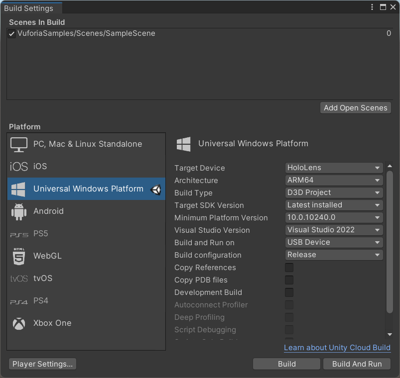
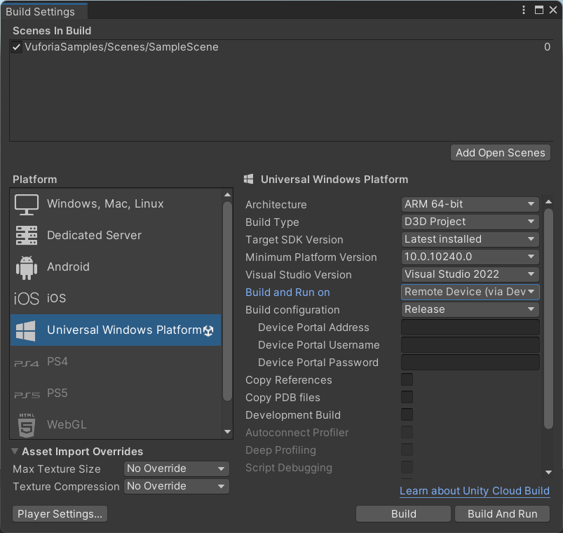

# VuforiaWithMRTKV2Samples
This is a sample of Vuforia Image Target with MRTK V2 on HoloLens2

## Develop Environment

* VuforiaSamples20203
    * Unity 2020.3.35f1
    * Mixed Reality Toolkit V2.8.2(Foundation only)
    * Vuforia 10.9.3
    * Visual Studio 2022
  
* VuforiaSamples20213
    * Unity 2021.3.4f1
    * Mixed Reality Toolkit V2.8.2(Foundation only)
    * Vuforia 10.9.3
    * Visual Studio 2022

## Build Step

1. Download add-vuforia-package-10-9-3.unitypackage form Vuforia engine developer portal.
1. clone this repo.
1. Open Unity Project(VuforiaSamples20203 or VuforiaSamples20213)
1. Select Assets > Import Package > Custom Package, aind import add-vuforia-package-10-9-3.unitypackage
1. restart unity editor(to resolve the vuforia package)
1. Set Vuforia Settings(API Key, Image Taget databasde...). may bee restart one or twice...
1. Open Assets\VuforiaSamples\Scenes\SampleScene
1. set the parameters to MixedRealitySceneContent\ImageTarget in Hierarchy
1. Open File > Build Settings, and set the below: **NOTICE!! Build ARM64 Architecture!**
1. Deploy HoloLens.

* VuforiaSamples20203 
* VuforiaSamples20213 
